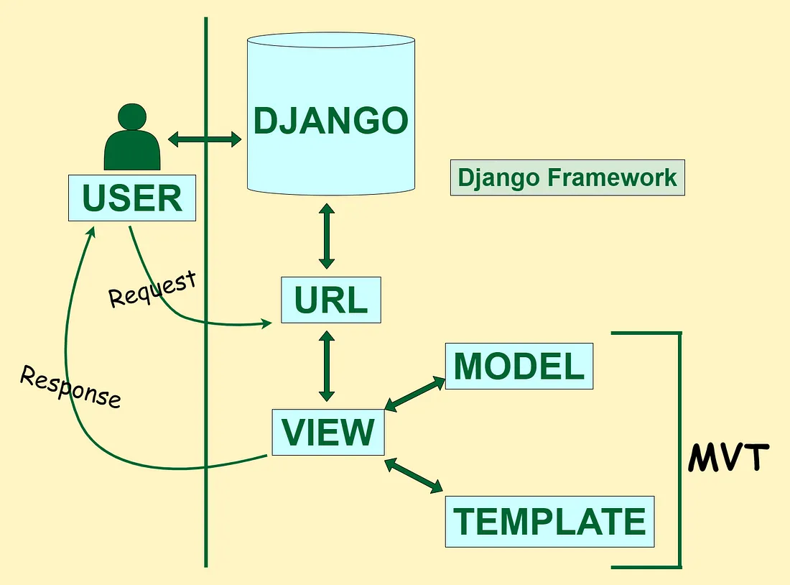
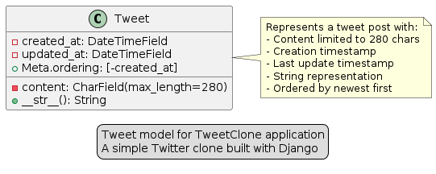

# TP 1 : Initiation à Django


## Introduction

Django est un framework web Python de haut niveau qui encourage un développement rapide et une conception propre et pragmatique([1](https://docs.djangoproject.com/en/5.1/)). Il suit le modèle architectural MVT (Model-View-Template), une variation du MVC, et inclut de nombreuses fonctionnalités "batteries included" comme un ORM puissant, un système d'administration automatique et un système de templates flexible.



Ce TP a pour objectif de vous initier aux bases de Django, de vous guider dans la création d'une application web simple et de vous préparer à explorer ses fonctionnalités avancées.

## Objectifs

- Installer Python et pip
- Créer un environnement virtuel
- Installer Django
- Créer un nouveau projet Django
- Comprendre la structure d'un projet Django
- Créer une première application
- Configurer les URLs et les vues
- Utiliser le système de templates

## Prérequis

- Un éditeur de code (VS Code recommandé)
- Un terminal de commande
- Une connexion internet
- Connaissances de base en Python, HTML et CSS

> **Ressources recommandées** :
>
> - [Python](https://www.python.org/)
> - [HTML & CSS](https://www.w3schools.com/html/)
> - [Documentation Django](https://docs.djangoproject.com/)

## Étapes

### 1. Installation de l'environnement

1. Téléchargez et installez Python depuis [python.org](https://python.org/)
   - Version 3.8 ou ultérieure recommandée
   - Cochez l'option "Add Python to PATH" lors de l'installation

2. Vérifiez l'installation en ouvrant un terminal :

   Pour vérifier Python :

   ```powershell
   python --version
   ```

   Pour vérifier pip :

   ```powershell
   pip --version
   ```

### 2. Configuration de l'environnement de développement

1. Installez VS Code depuis [code.visualstudio.com](https://code.visualstudio.com/)
2. Installez les extensions recommandées :
   - Python (Microsoft)
   - Django (Baptiste Darthenay)
   - SQLite Viewer

3. Créez un environnement virtuel :

   ```powershell
   # Créez un dossier pour votre projet
   mkdir mon-projet-django
   cd mon-projet-django
   
   # Créez l'environnement virtuel
   python -m venv .venv
   
   # Activez l'environnement virtuel
   .venv\Scripts\activate
   ```

4. Installez Django :

   ```powershell
   pip install django
   ```

### 3. Création d'un projet Django

1. Créez un nouveau projet([2](https://docs.djangoproject.com/en/5.1/intro/tutorial01/)):

   ```powershell
   django-admin startproject app .
   ```

2. Structure du projet créé :

   ```text
   .
   ├── manage.py          # Utilitaire en ligne de commande
   └── app/           # Package Python du projet
       ├── __init__.py    # Indique que c'est un package Python
       ├── settings.py    # Configuration du projet
       ├── urls.py        # Configuration des URLs
       ├── asgi.py        # Point d'entrée ASGI
       └── wsgi.py        # Point d'entrée WSGI
   ```

3. Lancez le serveur de développement :

   ```powershell
   python manage.py runserver
   ```

   Visitez [http://127.0.0.1:8000/](http://127.0.0.1:8000/) pour voir la page de bienvenue.

### 4. Création d'une première application

1. Créez une nouvelle application :

   ```powershell
   python manage.py startapp blog
   ```

2. Structure de l'application :

   ```text
   blog/
   ├── migrations/        # Dossier des migrations de base de données
   ├── __init__.py
   ├── admin.py          # Configuration de l'interface d'administration
   ├── apps.py           # Configuration de l'application
   ├── models.py         # Modèles de données
   ├── tests.py          # Tests unitaires
   └── views.py          # Vues de l'application
   ```

3. Ajoutez l'application dans `settings.py` :

   ```python:app/settings.py
   INSTALLED_APPS = [
       'django.contrib.admin',
       'django.contrib.auth',
       'django.contrib.contenttypes',
       'django.contrib.sessions',
       'django.contrib.messages',
       'django.contrib.staticfiles',
       'blog',  # Ajoutez votre application ici
   ]
   ```

### 5. Création des premiers modèles

1. Définissez un modèle dans `blog/models.py` :

   ```python:blog/models.py
   from django.db import models
   from django.utils import timezone

   class Article(models.Model):
       titre = models.CharField(max_length=200)
       contenu = models.TextField()
       date_creation = models.DateTimeField(default=timezone.now)
       
       def __str__(self):
           return self.titre
   ```

2. Créez et appliquez les migrations :

   ```powershell
   python manage.py makemigrations
   python manage.py migrate
   ```

### 6. Création des vues et URLs

1. Créez une vue dans `blog/views.py` :

   ```python:blog/views.py
   from django.shortcuts import render
   from .models import Article

   def liste_articles(request):
       articles = Article.objects.all().order_by('-date_creation')
       return render(request, 'blog/liste_articles.html', {'articles': articles})
   ```

2. Créez un fichier `blog/urls.py` :

   ```python:blog/urls.py
   from django.urls import path
   from . import views

   app_name = 'blog'
   urlpatterns = [
       path('', views.liste_articles, name='liste_articles'),
   ]
   ```

3. Modifiez `app/urls.py` :

   ```python:app/urls.py
   from django.contrib import admin
   from django.urls import path, include

   urlpatterns = [
       path('admin/', admin.site.urls),
       path('blog/', include('blog.urls')),
   ]
   ```

### 7. Création des templates

1. Créez la structure des templates :

   ```text
   blog/
   └── templates/
       └── blog/
           ├── base.html
           └── liste_articles.html
   ```

2. Créez le template de base `blog/templates/blog/base.html` :

   ```html:blog/templates/blog/base.html
   <!DOCTYPE html>
   <html lang="fr">
   <head>
       <meta charset="UTF-8">
       <title>Mon Blog</title>
       <style>
           body {
               max-width: 800px;
               margin: 0 auto;
               padding: 20px;
               font-family: Arial, sans-serif;
           }
           .article {
               margin-bottom: 20px;
               padding: 15px;
               border: 1px solid #ddd;
           }
       </style>
   </head>
   <body>
       <header>
           <h1>Mon Blog Django</h1>
       </header>
       <main>
           
           
       </main>
   </body>
   </html>
   ```

3. Créez le template de liste `blog/templates/blog/liste_articles.html` :

   ```html:blog/templates/blog/liste_articles.html
   

   Articles - {{ block.super }}

   
   <h2>Liste des articles</h2>
   
       <article class="article">
           <h3>{{ article.titre }}</h3>
           <p>{{ article.contenu|truncatewords:30 }}</p>
           <small>Publié le {{ article.date_creation|date:"d/m/Y" }}</small>
       </article>
   
       <p>Aucun article disponible.</p>
   
   
   ```

### 8. Configuration de l'Administration

1. Créez un superutilisateur (un compte administrateur avec tous les droits) :

   La commande suivante permet de créer un compte administrateur qui aura accès à l'interface d'administration Django :

   ```powershell
   python manage.py createsuperuser
   ```

   Vous devrez ensuite remplir les informations suivantes :

   ```text
   Username (leave blank to use 'your-username'): admin
   Email address: admin@example.com
   Password: admin
   Password (again): admin
   This password is too common.
   This password is entirely numeric.
   Bypass password validation and create user anyway? [y/N]: y
   Superuser created successfully.
   ```

   Note : Pour des raisons de sécurité, lorsque vous tapez votre mot de passe, celui-ci ne s'affichera pas dans le terminal. C'est un comportement normal qui protège votre mot de passe des regards indiscrets.

2. Enregistrez le modèle Article dans l'admin (`blog/admin.py`) :

   ```python:blog/admin.py
   from django.contrib import admin
   from .models import Article

   admin.site.register(Article)
   ```

3. Accédez à l'interface d'administration sur [http://127.0.0.1:8000/admin/](http://127.0.0.1:8000/admin/)

### 9. Création d'une Page de Détail

1. Ajoutez une vue de détail dans `views.py` :

   ```python:blog/views.py
   from django.shortcuts import render, get_object_or_404

   def detail_article(request, article_id):
       article = get_object_or_404(Article, pk=article_id)
       return render(request, 'blog/detail_article.html', {'article': article})
   ```

2. Ajoutez l'URL dans `blog/urls.py` :

   ```python:blog/urls.py
   urlpatterns = [
       path('', views.liste_articles, name='liste_articles'),
       path('article/<int:article_id>/', views.detail_article, name='detail_article'),
   ]
   ```

3. Créez le template `blog/templates/blog/detail_article.html` :

   ```html:blog/templates/blog/detail_article.html
   

   {{ article.titre }} - {{ block.super }}

   
   <article>
       <h2>{{ article.titre }}</h2>
       <p>{{ article.contenu }}</p>
       <p><small>Publié le {{ article.date_creation|date:"d/m/Y" }}</small></p>
       <a href="">Retour à la liste</a>
   </article>
   
   ```

### 10. Exercice : Gestion des Catégories

Dans cet exercice, vous allez améliorer le blog en ajoutant un système de catégorisation des articles.

**Objectifs** :

- Créer un modèle pour les catégories
- Lier les articles aux catégories
- Afficher les catégories dans l'interface d'administration
- Mettre à jour l'affichage des articles pour inclure leurs catégories

**Instructions** :

1. Modifiez le fichier `blog/models.py` pour :
   - Créer un modèle `Categorie` avec les champs :
     - `nom` (CharField)
     - `description` (TextField, optionnel)
   - Ajouter un champ `categorie` au modèle `Article` (ForeignKey)

2. Créez et appliquez les migrations nécessaires

3. Enregistrez le modèle `Categorie` dans l'interface d'administration

4. Mettez à jour les templates pour afficher la catégorie de chaque article :
   - Dans la liste des articles
   - Dans la page de détail d'un article

**Conseils** :

- Utilisez `models.ForeignKey` pour créer la relation entre Article et Categorie
- N'oubliez pas d'ajouter `on_delete=models.CASCADE` pour la clé étrangère
- Pensez à mettre à jour l'affichage dans les templates avec la nouvelle information de catégorie

**Validation** :

- Vous devriez pouvoir créer des catégories dans l'interface d'administration
- Chaque article devrait être associé à une catégorie
- La catégorie devrait être visible dans la liste des articles et la page de détail

### 11. Exercice : Gestion des Commentaires

**Objectifs :**

- Créer un modèle pour les commentaires
- Lier les commentaires aux articles
- Afficher les commentaires sous chaque article
- Permettre aux utilisateurs d'ajouter des commentaires via un formulaire

**Instructions :**

1. Modifiez le fichier `blog/models.py` pour :
   - Créer un modèle `Commentaire` avec les champs :
     - `article` (ForeignKey vers Article)
     - `auteur` (CharField)
     - `contenu` (TextField)
     - `date_creation` (DateTimeField avec valeur par défaut)

2. Créez et appliquez les migrations nécessaires.

3. Enregistrez le modèle `Commentaire` dans l'interface d'administration.

4. Créez un formulaire Django pour permettre aux utilisateurs d'ajouter des commentaires.

5. Mettez à jour les vues et les templates pour afficher les commentaires sous chaque article et intégrer le formulaire d'ajout de commentaire.

### 12. Exercice : Pagination des Articles

**Objectifs :**

- Implémenter la pagination pour la liste des articles
- Afficher un nombre limité d'articles par page
- Ajouter des contrôles de navigation entre les pages

**Instructions :**

1. Modifiez la vue `liste_articles` dans `blog/views.py` pour utiliser la pagination Django (`Paginator`).

2. Affichez 5 articles par page.

3. Mettez à jour le template `liste_articles.html` pour inclure des contrôles de pagination (précédent, suivant, numéros de page).

### 13. Exercice : Recherche d'Articles

**Objectifs :**

- Ajouter une fonctionnalité de recherche d'articles par titre ou contenu
- Afficher les résultats de recherche dans une page dédiée

**Instructions :**

1. Créez une nouvelle vue `recherche_articles` dans `blog/views.py`.

2. Ajoutez un formulaire de recherche dans le template `base.html`.

3. Créez une URL dédiée à la recherche dans `blog/urls.py`.

4. Affichez les résultats de recherche dans un nouveau template `recherche_articles.html`.

### 14. Projet Final : Clone de Twitter (TweetClone)

**Objectifs :**

- Créer une application similaire à Twitter avec les fonctionnalités de base
- Implémenter un système de tweets avec CRUD (Create, Read, Update, Delete)
- Créer un fil d'actualité (feed) pour afficher les tweets
- Apprendre à gérer les modèles et les formulaires Django

**Étape 1 : Configuration du Projet**

1. Création du projet :
   - Créez un nouveau projet Django
   - Créez une application `tweets`
   - Ajoutez l'application dans `INSTALLED_APPS`

**Étape 2 : Modélisation des Données**



Le diagramme ci-dessus montre la structure du modèle `Tweet` que nous allons implémenter. Il contient :

- Un champ `content` pour le contenu du tweet (limité à 280 caractères)
- Un champ `created_at` pour la date de création
- Un champ `updated_at` pour la date de dernière modification
- Une méthode `__str__` pour l'affichage
- Une configuration Meta pour l'ordre d'affichage (du plus récent au plus ancien)

1. Création du modèle Tweet :
   - Définissez les champs (contenu, dates)
   - Ajoutez les métadonnées (ordering, etc.)
   - Implémentez la méthode `__str__`

2. Migrations :
   - Créez les migrations pour votre modèle
   - Appliquez les migrations

**Étape 3 : Interface d'Administration**

1. Configuration de l'admin :
   - Enregistrez le modèle Tweet dans l'admin
   - Personnalisez l'affichage des tweets
   - Testez la création et modification via l'admin

2. Amélioration de l'interface admin :
   - Ajoutez des champs de recherche
   - Configurez les filtres
   - Personnalisez l'affichage des listes

**Étape 4 : URLs et Vues de Base**

1. Configuration des URLs :
   - Créez le fichier `urls.py` dans l'application
   - Configurez les URLs principales
   - Liez les URLs de l'application

2. Création des vues de base :
   - Implémentez la vue du feed
   - Créez la vue de détail
   - Testez l'affichage des données

**Étape 5 : Templates et Style**

1. Structure des templates :
   - Créez un template de base
   - Implémentez l'héritage de templates
   - Ajoutez les blocs nécessaires

2. Styles de base :
   - Ajoutez le CSS de base
   - Rendez l'interface responsive
   - Stylisez les éléments principaux

**Étape 6 : Formulaires et Création**

1. Création des formulaires :
   - Définissez le formulaire pour les tweets
   - Configurez les widgets et la validation
   - Ajoutez les styles des formulaires

2. Implémentation de la création :
   - Ajoutez la vue de création
   - Intégrez le formulaire dans le template
   - Testez la création de tweets

**Étape 7 : Modification et Suppression**

1. Modification :
   - Créez la vue de modification
   - Ajoutez le formulaire d'édition
   - Gérez la redirection

2. Suppression :
   - Implémentez la vue de suppression
   - Ajoutez la confirmation
   - Testez la suppression

**Étape 8 : Améliorations**

1. Pagination :
   - Ajoutez la pagination au feed
   - Configurez le nombre d'éléments par page
   - Stylisez la navigation

2. Messages de feedback :
   - Ajoutez des messages de confirmation
   - Gérez les erreurs
   - Améliorez l'expérience utilisateur

**Points de Validation pour Chaque Étape :**

1. **Étape 1-2 :**
   - Le projet est créé et configuré
   - Les modèles sont créés et migrés
   - La base de données est prête

2. **Étape 3 :**
   - L'interface d'administration est fonctionnelle
   - Les tweets peuvent être créés via l'admin
   - L'affichage est personnalisé

3. **Étape 4 :**
   - Les URLs sont correctement configurées
   - Les vues de base fonctionnent
   - Les données s'affichent correctement

4. **Étape 5 :**
   - Les templates sont bien structurés
   - L'interface est cohérente
   - Le design est responsive

5. **Étape 6 :**
   - Les formulaires fonctionnent
   - La création de tweets est possible
   - La validation fonctionne

6. **Étape 7-8 :**
   - CRUD complet fonctionnel
   - Pagination implémentée
   - Interface utilisateur intuitive

**Bonus :**

- Ajoutez un système de recherche de tweets
- Implémentez des hashtags cliquables
- Créez une page de tendances
- Ajoutez des filtres de recherche avancés

**Ressources :**

- [Django Models](https://docs.djangoproject.com/en/stable/topics/db/models/)
- [Django Admin](https://docs.djangoproject.com/en/stable/ref/contrib/admin/)
- [Django Forms](https://docs.djangoproject.com/en/stable/topics/forms/)
- [Django Templates](https://docs.djangoproject.com/en/stable/topics/templates/)
- [Django Class-Based Views](https://docs.djangoproject.com/en/stable/topics/class-based-views/)

## Ressources Supplémentaires

- [Documentation officielle de Django](https://docs.djangoproject.com/)
